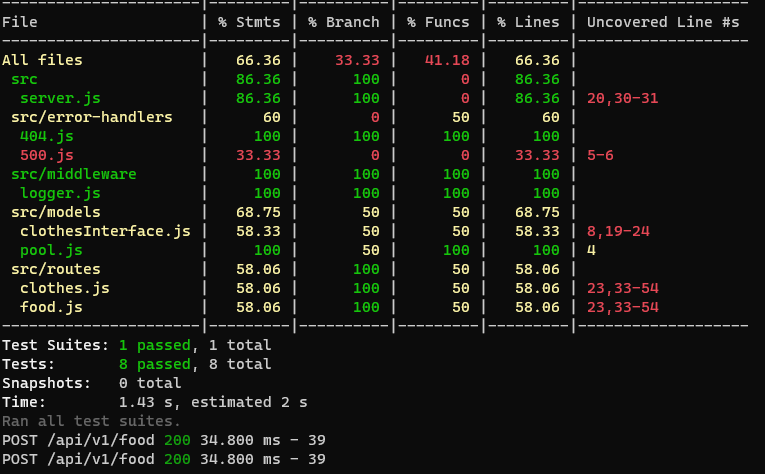
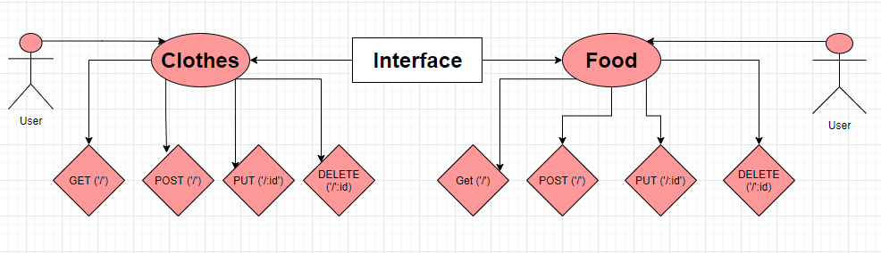

# sql-api-server

# api-server

### Dynamic API Phase 3: Add Persistence (Database) to the API

### swap out the in-memory data models used in the previous lab for Mongo database models.

### Tests & Deployment :

[Test](https://github.com/Sukina12/sql-api-server/actions)

[PullRequest](https://github.com/Sukina12/sql-api-server/pull/1)

#### Setup

* .env Requirement : PORT = 9000

#### Running The App :
1. Make new repo.
2. clone the repo.
3. npm i all packages.
4. npm start.
5. Endpoints : return Hello from Sukina message.
6. Tests : 
  * npm run test
  * npm run lint

### 
